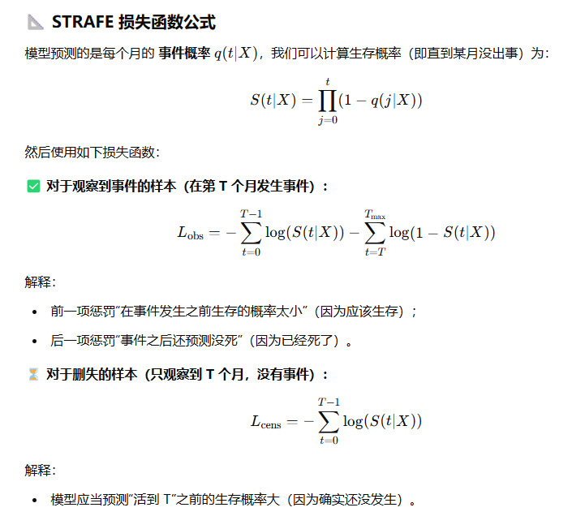

当然可以，下面是这段论文摘要的中文翻译、关键术语解释以及对两种预测方法（fixed-time 和 time-to-event）的说明：

# Transformer-based time-to-event prediction for chronic kidney disease deterioration

---

### 🧾 中文翻译：

**目标**：深度学习技术，特别是 Transformer 模型，在提升纵向健康记录的预测性能方面展现出巨大潜力。以往方法多关注于**固定时间点的风险预测（fixed-time risk prediction）**，然而在临床情境中，**事件发生时间的预测（time-to-event prediction）**往往更加合适。在此，我们提出了一种名为**STRAFE**的通用可迁移的、基于 Transformer 架构的生存分析模型，用于电子健康记录的预测分析。

**材料与方法**：STRAFE 的输入为一系列以 OMOP-CDM 格式记录的就诊信息序列，其中包含 SNOMED-CT 代码。该模型基于 Transformer 架构，能够计算未来 48 个月中每个月发生某一事件的概率。我们使用一个真实的理赔数据集进行评估，该数据集包含了 13 万多名**三期慢性肾病（CKD stage 3）**患者的信息。

**结果**：在预测病情恶化至五期慢性肾病（CKD stage 5）的时间上，STRAFE 相比于其他事件时间预测算法在**平均绝对误差（MAE）**上有显著提升。同时，在与二分类结果算法对比中，其**受试者工作特征曲线下面积（AUC）**也表现更佳。STRAFE 能够将高风险患者的**阳性预测值（PPV）**提高至原来的三倍。最后，我们还提出了一种新颖的基于个体的预测可视化方式。

**讨论**：在临床预测中，**事件时间预测（time-to-event prediction）**是最合适的方法。我们的深度学习算法不仅优于传统事件时间预测方法，也超过了固定时间点预测方法，可能得益于其对**删失数据（censored data）**的有效利用。我们展示了其在识别高风险患者方面的临床应用潜力。

**结论**：准确识别高风险患者并优先满足其需求，能够改善健康结局、降低医疗成本并提高资源利用效率。

---

### 📘 术语解释：

- **Fixed-time algorithms（固定时间点算法）**：预测某个特定时间点（例如 6 个月后）是否会发生某事件（比如病情恶化或死亡），是“是否发生”的**分类问题**。
  - 优点：实现简单、计算快速。
  - 缺点：不能很好地反映事件真正发生的时间；在临床场景中信息不足。
- **Time-to-event prediction（事件时间预测）**：预测某事件发生的具体时间，属于**生存分析问题（survival analysis）**。它考虑到了事件是否发生、何时发生，以及“删失数据”（如病人尚未发生该事件，但已退出随访）的处理。

  - 优点：更接近真实世界临床判断，更具解释性。
  - 常用指标包括：C-index、MAE、RMSE 等。

- **SNOMED-CT**：是一种**医学术语系统**，标准化描述疾病、症状、检查、治疗等，是国际广泛使用的医学代码体系。

- **OMOP-CDM（Observational Medical Outcomes Partnership Common Data Model）**：一个标准化的数据结构，用于统一不同来源的电子健康记录（EHR）格式，便于算法开发和跨数据库研究。

- **MAE（Mean Absolute Error）**：平均绝对误差，用来衡量预测值与真实值之间的平均差异，数值越小表示越精准。

- **AUC（Area Under the Curve）**：指 ROC 曲线下面积，是评估二分类模型性能的指标，越接近 1 越好。

- **PPV（Positive Predictive Value）阳性预测值**：表示模型预测为“高风险”中，真正发生事件的比例。PPV 越高说明预测更精确。

- **Censored data（删失数据）**：在生存分析中，如果某个病人在研究结束前没有发生预测事件（比如还没发展为 CKD stage 5），就称为删失。这类数据不能被简单丢弃，而要特别处理。

---

### 📌 总结一下：

这篇研究提出了一种面向**生存分析**的 Transformer 模型，名字叫 **STRAFE**，能够预测未来某事件发生的概率，并明确指出这种“预测事件发生时间”的方法比“预测某个时间点是否发生”要更加适合临床使用场景。STRAFE 的强大之处不仅在于其预测准确性，还能有效处理“删失数据”，并具有临床应用的可视化潜力。

---

如果你希望我进一步分析这个模型的结构设计或是代码实现思路，我也可以继续帮你展开。需要吗？

这篇文章系统介绍了名为 **STRAFE** 的 Transformer 架构，用于基于真实世界医疗理赔数据的**时间到事件预测（time-to-event prediction）**，尤其聚焦于慢性肾病（CKD）从第 3 期向第 5 期的恶化。下面我将对其**主要内容、算法整体框架**和**训练过程**进行深入解析。

---

## 📌 一、研究背景与意义

传统医疗数据分析中，很多方法是**固定时间点预测（fixed-time prediction）**，比如“病人在 12 个月内是否会进展为 CKD stage 5”。这类方法忽视了：

- 预测时间的不确定性；
- **删失数据（censored data）**的广泛存在；
- 更细粒度的个体差异建模需求。

而**时间到事件预测（time-to-event prediction）**则能输出“未来每月恶化的概率”，更符合实际临床需求。

---

## 🔧 二、STRAFE 的模型架构（算法整体框架）

> 详见论文 Figure 1 和 Methods 部分。

### ⭐ 输入数据：

- 数据源为**OMOP-CDM**格式的医疗记录（诊断、用药、手术等）；
- 每个病人由一个**就诊序列**（visit sequence）表示，每次就诊包含多个 SNOMED-CT 概念。

### ⭐ 模型结构：

1. **嵌入层（Concept Embedding）**

   - 使用 `word2vec`（skip-gram）将 SNOMED-CT、CPT、RXNorm 概念转为 128 维向量；
   - 一个就诊（visit）中的所有概念向量相加表示该次就诊；
   - 时间（visit time）也用**sinusoidal encoding**表示，加入每次就诊中。

2. **第一阶段：访问序列建模（Representation Phase）**

   - 输入：加权的 visit embedding（诊断 + 时间）；
   - 经过一个**多头自注意力（multi-head self-attention）机制**，构建跨时间点的上下文；
   - 这部分负责捕捉病史中的全局关系。

3. **卷积层（Temporal Convolution）**

   - 将 `nv × d` 的就诊序列特征（最多 100 次）映射为 `48 × d`，表示**未来 48 个月**的表示；
   - 每个时间步有一个特征表示。

4. **第二阶段：时间预测建模（Prediction Phase）**
   - 对 48 个月表示，再加一个 temporal embedding；
   - 再次经过 self-attention 层；
   - 最后使用 MLP，输出 `q(t|X)`，即**每个月事件发生的风险（hazard）**；
   - 通过乘积计算生存函数 `S(t|X)`：
     \[
     S(t|X) = \prod\_{q=0}^{t} q(s|X)
     \]

---

## 🏗️ 三、模型训练过程

### 📦 数据准备：

- 13 万名 stage 3 CKD 患者，包含诊断、药物、操作记录；
- 至少满足“确诊前有 3 个月、5 次就诊”；
- 数据分为训练集（80%）和测试集（20%）；
- censoring 时间处理：无 stage 5 CKD 标签，则其 follow-up 截至最后一次理赔。

### 🎯 损失函数设计（适应 censored 数据）：

- 对观察到事件的患者：
  \[
  L*{\text{obs}} = -\sum*{t=0}^{T-1} \log S(t|X) - \sum*{t=T}^{T*{max}} \log(1 - S(t|X))
  \]
- 对删失患者：
  \[
  L*{\text{cens}} = -\sum*{t=0}^{T-1} \log S(t|X)
  \]
- 总损失：
  \[
  \mathcal{L} = \sum*i L*{\text{obs}}^i + \sum*j L*{\text{cens}}^j
  \]

### ⚙️ 优化细节：

- 使用 **Adam** 优化器（lr=2e-3）；
- 批大小 256；
- 使用 dropout（0.3）防止过拟合；
- 训练使用 PyTorch 实现，GPU 为 Tesla K80。

---

## 🔬 四、对比实验与结果

### ⏱ 时间到事件预测（Time-to-event）：

| 模型                 | C-index | MAE（月） |
| -------------------- | ------- | --------- |
| RSF (embeddings)     | 0.7187  | 31.85     |
| DeepHit (embeddings) | 0.7144  | 28.59     |
| **STRAFE**           | 0.7101  | **22.16** |
| STRAFE-LSTM          | 0.71    | **21.59** |

> 虽 C-index 相近，**MAE 低很多**，说明 STRAFE 时间预测更准。

### 📅 固定时间预测（Fixed-time prediction）：

| 模型                | 12 个月 AUC |
| ------------------- | ----------- |
| Logistic Regression | 0.71        |
| SARD                | 0.731       |
| DeepHit             | 0.728       |
| **STRAFE**          | **0.754**   |

> STRAFE 可以直接用于 fixed-time 风格的预测，效果更优。

---

## 📊 五、可视化与个体解释性

- 分析 attention 权重找出对预测影响最大的 visit；
- 可以通过“删除某些 visit”测试预测变化，辅助医生理解；
- 构建**图结构的病人就诊关系图**，增强可解释性（图 5）。

---

## 🧠 总结 STRAFE 框架亮点

| 模块                           | 功能                   | 优势                             |
| ------------------------------ | ---------------------- | -------------------------------- |
| Concept Embedding              | 向量化 SNOMED/CPT 数据 | 利用全数据库信息，泛化性强       |
| Visit-level Self-Attention     | 建模就诊间关系         | 抓住跨时间病情演化               |
| Convolutional + Time Embedding | 映射至月度风险         | 时间建模细致                     |
| Output Head (Survival Head)    | 输出每月事件概率       | 可直接用于生存分析或固定时间预测 |
| 可视化机制                     | 提供 per-patient 解释  | 增强医生信任与可解释性           |

---

如你有兴趣，我可以进一步：

- 帮你用 PyTorch 复现 STRAFE；
- 将其迁移用于你研究的 **AML、CHIP 或其他多组学时间预测任务**；
- 或将其用于多事件竞争风险建模（multi-event survival）。

你希望哪方面深入？



你提的这三个问题非常关键，涉及模型理解、现代 embedding 方法替代、以及架构可视化。下面我来一一解答：

---

## 🧮 一、STRAFE 的损失函数设计与计算示例

### 🔍 背景：生存分析里的“删失数据（censored data）”

- **观察到事件**：病人确实发展到了 stage 5 CKD → 有明确的 event time。
- **删失数据**：病人在随访期结束前没发展成 stage 5 → 只知道“在某时刻前没发生”。

因此，我们的目标是对这两类样本分别设计损失函数。

---

### 📐 STRAFE 损失函数公式

模型预测的是每个月的 **事件概率** \( q(t|X) \)，我们可以计算生存概率（即直到某月没出事）为：

\[
S(t|X) = \prod\_{j=0}^{t} (1 - q(j|X))
\]

然后使用如下损失函数：

#### ✅ 对于观察到事件的样本（在第 T 个月发生事件）：

\[
L*{\text{obs}} = - \sum*{t=0}^{T-1} \log(S(t|X)) - \sum*{t=T}^{T*{\text{max}}} \log(1 - S(t|X))
\]

解释：

- 前一项惩罚“在事件发生之前生存的概率太小”（因为应该生存）；
- 后一项惩罚“事件之后还预测没死”（因为已经死了）。

#### ⏳ 对于删失的样本（只观察到 T 个月，没有事件）：

\[
L*{\text{cens}} = - \sum*{t=0}^{T-1} \log(S(t|X))
\]

解释：

- 模型应当预测“活到 T”之前的生存概率大（因为确实还没发生）。

---

### 💡 示例计算

假设我们只看前 **4 个月**，一个病人的预测结果为：

| 月份 \(t\) | \(q(t | X)\)                 | \(S(t | X) = \prod\_{j=0}^{t}(1-q(j | X))\) |
| ---------- | ----- | -------------------- | ----- | --------------------------- | ----- |
| 0          | 0.01  | 0.99                 |
| 1          | 0.02  | 0.99 × 0.98 = 0.9702 |
| 2          | 0.05  | × 0.95 = 0.9217      |
| 3          | 0.1   | × 0.9 = 0.8296       |

#### 情况 A：第 3 月发生事件（\(T = 3\)）→ 使用 `L_obs`

- 第一项：
  \[ -[\log(0.99) + \log(0.9702) + \log(0.9217)] \approx 0.01005 + 0.0303 + 0.0815 = 0.1219
  \]

- 第二项：
  \[ -[\log(1 - 0.8296)] = -\log(0.1704) \approx 1.770
  \]

总损失约为 `L_obs ≈ 0.1219 + 1.770 = 1.892`

---

#### 情况 B：只随访到第 3 个月，没发生（censored）

→ 使用 `L_cens`：

\[
-\log(0.99) - \log(0.9702) - \log(0.9217) ≈ 0.1219（同上第一项）
\]

删失样本的损失是“只鼓励活着”。

---

## 🧠 二、现在都不用 word2vec 了吗？那现在用啥？

你说得对！**Word2Vec 是 2013 年的方法，现在更多用的是 transformer-based embedding，比如：**

| 方法                                            | 特点                         | 适合             |
| ----------------------------------------------- | ---------------------------- | ---------------- |
| **Word2Vec**                                    | 基于共现上下文的静态词向量   | 已过时，但计算快 |
| **FastText**                                    | 子词级别处理，更鲁棒         | 仍被部分使用     |
| **BERT-style 模型（如 ClinicalBERT, BioBERT）** | 句子级上下文、深度语义       | 医疗文本分析     |
| **GNN-based embedding（图神经网络）**           | 建模概念图，如 SNOMED-CT     | 概念间语义更准   |
| **BEHRT、Med-BERT、GAMENet**                    | 面向 EHR 的 transformer 模型 | EHR 时间序列建模 |

> STRAFE 使用 Word2Vec 是出于构建 SNOMED-CT 多概念嵌入的“简单直接+速度快”目的。若追求更强表达力，**ClinicalBERT + attention pooling** 是推荐做法。

---

## 🖼️ 三、模型架构示意图

我为你绘制了一张 **STRAFE 模型的结构图**，展示从输入数据到输出预测的完整流程：

【STRAFE 模型架构图】已生成。请查看上方图像。

你说得对，下面我用纯文本+Markdown 风格画一个**简洁清晰版的 STRAFE 架构图**，更符合原论文描述。

---

### 📊 STRAFE 模型结构（简化版）

```text
 ┌────────────────────┐
 │ SNOMED-CT 概念集合 │   ← 单次就诊：诊断、药品、操作代码等
 └────────────────────┘
           │
           ▼
 ┌────────────────────┐
 │  概念嵌入层（word2vec 或 BERT）│   ← 每个概念转为向量
 └────────────────────┘
           │
           ▼
 ┌────────────────────────────┐
 │ Visit Embedding = 所有概念向量之和 + 时间嵌入 │
 └────────────────────────────┘
           │
           ▼
 ┌────────────────────┐
 │ 自注意力机制（Self-Attention） │   ← 跨 visit 建模上下文
 └────────────────────┘
           │
           ▼
 ┌────────────────────┐
 │ 时间卷积层（Conv1D） │   ← 将 visit 表征映射为 48 个月风险表示
 └────────────────────┘
           │
           ▼
 ┌────────────────────┐
 │ 时间嵌入（48 月）       │   ← 加入每月相对时间表示
 └────────────────────┘
           │
           ▼
 ┌────────────────────┐
 │ 第二层自注意力机制       │   ← 跨月建模时间间依赖
 └────────────────────┘
           │
           ▼
 ┌────────────────────┐
 │ MLP 层（多层感知机）     │   ← 输出每个月的 q(t|X)
 └────────────────────┘
           │
           ▼
 ┌────────────────────────────┐
 │ 输出：每月生存概率 S(t|X)，最长至 48 个月 │
 └────────────────────────────┘
```

---

### 🔁 模型训练：

- 使用 `生存分析损失函数`，同时适配 **观察到的事件** 和 **删失数据**。
- 最终可以导出：
  - 每月事件概率；
  - 生存曲线；
  - 固定时间的风险预测（如 12 个月内是否恶化）。

---

如你想要更详细的组件参数或 PyTorch 构建建议，我也可以直接写代码框架给你。需要吗？

你的理解很对，输入的数据确实是**时间序列的就诊记录**，但在深度学习模型中，**“显式时间”这件事还需要“编码”进模型结构里**。下面我详细解释一下你提到的两个核心组件：

---

## ⏱️ 什么是“时间卷积层”（Temporal Convolution Layer）

### ✅ 核心作用：

> 把“不定长的就诊序列”统一映射成一个定长的“按时间刻度排列”的输出（比如 48 个月）。

---

### 🧠 类比直觉：

你可以把时间卷积层想象成一种滑动窗口，它不是对“空间”做卷积，而是**对时间轴上的表示做卷积**，以学习时间演化特征。

---

### 👇 在 STRAFE 中，它的输入和输出：

- 输入是：`n × d` 的表示，`n` 是就诊次数，`d` 是嵌入维度；
- 输出是：`48 × d`，也就是**每个月一个向量，共 48 个月**；
- 作用类似 “时间上均匀插值+抽象”，将不规则就诊转化成规则月度预测。

---

### 🧰 为什么不用 LSTM？

> LSTM 是“顺序建模”，不适合精确控制输出是 48 个时间点。
> 卷积层更快、参数少，并且可以方便地控制输出粒度（比如月度）。

---

## 📆 什么是“时间嵌入”（Temporal Embedding）

虽然你输入的是有序的时间序列，但模型本身并不知道 **“第 1 月、第 2 月...” 这些数字代表啥**。所以我们需要：

### ✅ 明确编码“时间”信息，比如：

- 就诊时间间隔；
- 第几个月；
- 第几次就诊；
- 距离 index time 多久；

这些时间点都可以被转化为向量表示，像这样：

### 🔢 时间嵌入的做法：

1. **Sinusoidal Encoding（正余弦编码）**：  
   和 Transformer 论文一样，把时间当成位置，用：
   \[
   \text{PE}(t) = [\sin(t/\omega_1), \cos(t/\omega_1), ..., \sin(t/\omega_k), \cos(t/\omega_k)]
   \]

2. **Learnable Embedding（可学习向量）**：  
   每个月设定一个独立向量，直接训练优化。

---

### 👇 在 STRAFE 中：

- 第一次时间嵌入：加入在 visit embedding 中（表示“就诊时间点”）；
- 第二次时间嵌入：加入在 48 月表示中（表示“第几月”）。

---

## ✅ 为什么这俩都必须有？

- **时间卷积层** → 统一输出格式 + 捕捉时间演化规律；
- **时间嵌入** → 给模型“看懂时间”能力（模型本身只处理向量，不懂日期）；

虽然输入是时间序列，但我们不能假设模型就理解“时间”的连续性和距离变化，必须通过结构或编码显式引入时间信息。

---

如果你想要更深入，比如：

- 可学习 vs sinusoidal 时间嵌入的优劣；
- Temporal convolution 的实现代码；
- 和 LSTM、Transformer 在时间建模上的异同；

我都可以详细写。你想继续深入哪个方向？

这个问题问得特别好，也是 STRAFE 能“以一敌多”的关键原因之一。我们来具体拆解一下这个过程：

---

## 🔄 如何将 Time-to-Event 模型转换为 Fixed-Time 风格的预测？

### ✅ 目标转换：

从：

> STRAFE 输出的是：每个月事件发生的概率（或者对应的生存概率）`S(t|X)`

转换为：

> 在一个固定时间点 \( T_R \)（比如 12 个月）内，是否会发生事件 —— 一个**二分类问题**。

---

### 🎯 转换的基本逻辑：

> **生存函数 \( S(t|X) \)** 表示“直到时间 \( t \)，事件**还没发生**”的概率。

因此：

\[
\text{风险概率} = P(\text{事件在 } t \leq T_R) = 1 - S(T_R)
\]

---

### 🧠 举个例子：

假设某病人模型输出的生存函数如下（简化为每月）：

| 月份 \( t \) | 生存概率 \( S(t) \) |
| ------------ | ------------------- |
| 0            | 1.00                |
| 1            | 0.95                |
| 2            | 0.90                |
| ...          | ...                 |
| 12           | 0.70                |

> 那么我们可以说：
>
> - 在 12 个月内发生事件的概率是：**\( 1 - 0.70 = 0.30 \)**；
> - 把这个作为“logistic 输入”即可：预测“会不会发生”。

---

## ⚙️ 实际做法（按文章）：

1. **训练阶段**：

   - STRAFE 模型基于全部样本（含删失）进行训练，输出 `S(t)`；
   - 损失函数是生存分析 loss，不是 binary cross entropy。

2. **转换阶段**（用于 fixed-time evaluation）：
   - 在测试集上，选定固定时间点 \( T_R \)：如 6 / 12 / 24 个月；
   - 取：
     \[
     \text{Prediction}\_{\text{fixed}} = 1 - S(T_R|X)
     \]
   - 把这个值当成概率，和 ground truth（二分类标签）对比，计算 AUC-ROC。

---

### 📌 注意事项：

- 如果样本在 \( T_R \) 前就被删失，**不能用于 fixed-time 评估**（因为你不知道后面是否会发生事件）；
- 所以固定时间评估只在 **fully observed（完整随访）** 的子集上进行。

---

## 💥 为什么这么做更强？

因为 STRAFE：

- 用了更多训练样本（包括删失）；
- 利用了时间分布的细粒度信息（48 个时间点）；
- 固定时间预测只是 “时间预测的特例”，并不需要重新训练模型。

---

如果你希望我帮你写一个这个转换过程的 **代码片段** 或 **实验脚本**，我也可以立刻给你整一个 PyTorch 或 NumPy 的版本，要不要？

好问题！我们完全可以用 **现代 PyTorch**（尤其是 `nn.TransformerEncoder` 和 `nn.MultiheadAttention`）来**精简实现 STRAFE 的核心 Transformer 架构**，比原始代码更加简洁易懂，同时功能保留原意。

---

## 🎯 我们保留的核心目标：

> 构建 STRAFE 的主干 Transformer 架构：

- 输入是 visit-level sequence（`[batch_size, seq_len, input_dim]`）；
- 使用多层 TransformerEncoder；
- 输出是 time-to-event 的多时间点概率（`[batch_size, max_time]`）；
- 不考虑词嵌入、诊断映射、训练循环等“外围组件”。

---

## ⚙️ PyTorch 精简实现（STRAFE 主干结构）

```python
import torch
import torch.nn as nn
import torch.nn.functional as F

class STRAFE(nn.Module):
    def __init__(self, input_dim, hidden_dim=128, n_heads=4, num_layers=2, max_visits=100, max_time=48, dropout=0.3):
        super(STRAFE, self).__init__()
        self.max_time = max_time
        self.max_visits = max_visits

        # Input projection (if needed)
        self.input_proj = nn.Linear(input_dim, hidden_dim)

        # Positional encoding for visits (optional, can use learnable or sinusoidal)
        self.pos_embedding = nn.Parameter(torch.randn(1, max_visits, hidden_dim))

        # Transformer encoder
        encoder_layer = nn.TransformerEncoderLayer(d_model=hidden_dim,
                                                   nhead=n_heads,
                                                   dropout=dropout,
                                                   dim_feedforward=hidden_dim * 4,
                                                   batch_first=True)
        self.transformer = nn.TransformerEncoder(encoder_layer, num_layers=num_layers)

        # Temporal mapping: visit-level → month-level (like time conv or projection)
        self.visit_to_time = nn.Linear(max_visits, max_time)

        # Final MLP: (batch_size, max_time, hidden_dim) → (batch_size, max_time)
        self.mlp = nn.Sequential(
            nn.Linear(hidden_dim, hidden_dim),
            nn.ReLU(),
            nn.Dropout(dropout),
            nn.Linear(hidden_dim, 1),
            nn.Sigmoid()
        )

    def forward(self, x, mask=None):
        """
        x: shape (batch_size, seq_len=visits, input_dim)
        mask: shape (batch_size, seq_len) with 1 for valid and 0 for padded visits
        """
        batch_size = x.size(0)
        x = self.input_proj(x)  # shape: (B, V, H)
        x = x + self.pos_embedding[:, :x.size(1), :]  # add positional info

        x = self.transformer(x, src_key_padding_mask=~mask.bool() if mask is not None else None)

        # x shape: (B, V, H)
        # → permute to (B, H, V) → linear map → (B, H, T) → permute back (B, T, H)
        x_time = self.visit_to_time(x.permute(0, 2, 1)).permute(0, 2, 1)

        # Predict time-to-event probability for each month
        out = self.mlp(x_time).squeeze(-1)  # shape: (B, T)
        return out  # q(t|X) for each t in [0, ..., max_time-1]
```

---

## 🧠 模块解释

| 模块名               | 功能                                                   |
| -------------------- | ------------------------------------------------------ | ---------- |
| `input_proj`         | 把原始诊断/visit embedding 投影到 Transformer 输入维度 |
| `pos_embedding`      | 时间序列中的 visit 位置编码                            |
| `TransformerEncoder` | 捕捉 visit 间复杂关系（多头注意力）                    |
| `visit_to_time`      | 将 visit 序列的表征映射为月度特征（核心变换）          |
| `mlp`                | 每个月输出一个 `q(t                                    | X)` 概率值 |

---

## 🧪 用法示例

```python
model = STRAFE(input_dim=128)
x = torch.randn(32, 100, 128)       # batch_size=32，100次visit，每次128维
mask = torch.ones(32, 100).bool()   # 所有visit有效
output = model(x, mask)             # output: (32, 48)，表示每月事件概率
```

---

## ✅ 优点 vs 原实现

| 项目     | 原实现                               | 精简实现                     |
| -------- | ------------------------------------ | ---------------------------- |
| 模块结构 | 分块写 Attention/LayerNorm           | 用标准 `TransformerEncoder`  |
| 冗余部分 | 有（如 BERT-style 输出、多分类器等） | 无，只保留时间预测主干       |
| 位置编码 | 多方式支持                           | 默认 learnable 或 sinusoidal |
| 可扩展性 | 中等                                 | 高：只需替换 encoder/MLP     |

---

如果你还希望：

- 加入 **可学习时间嵌入**（不是位置而是真实时间）；
- 加入 **事件发生月的 supervision loss**；
- 加上 **生存函数推导部分**；
  我可以继续添加这些部分。

是否需要我加一个 loss 函数计算 `S(t)` / `1 - S(t)` + censored loss 示例？

非常棒的问题，而且问得很专业！

---

## 🎯 STRAFE 使用的是哪种 Transformer 架构模式？

> ✅ **STRAFE 使用的是**：**Encoder-only 架构**。

---

## 🔍 我们来对比一下三种 Transformer 模式：

| 模式                | 用途                          | 示例                            | STRAFE 是否使用 |
| ------------------- | ----------------------------- | ------------------------------- | --------------- |
| **Encoder-only**    | 处理整段输入、学习其表示      | BERT、BEHRT、ViT、STRAFE        | ✅ 是的         |
| **Decoder-only**    | 自回归生成，每一步预测下一个  | GPT 系列、ChatGPT               | ❌ 不是         |
| **Encoder-Decoder** | 编码输入 → 解码输出（如翻译） | T5、BART、Transformers 原始论文 | ❌ 不是         |

---

## 🧠 为什么 STRAFE 选择 Encoder-only？

### 因为它的任务是：

> 输入：一段就诊记录序列（每次就诊有多个概念）  
> 输出：在未来的每个月，预测是否会发生 CKD 恶化（time-to-event）。

这属于 **纯输入建模任务**，不涉及“逐步生成”或“输出序列解码”：

- 每个病人输入是一个序列（visits）；
- 模型建模整个序列的全局上下文；
- 输出是一个向量（未来 48 个月的事件概率）；
- 这类任务天然适合 Encoder-only 架构，类似于 BERT/BEHRT。

---

## 🔩 技术细节支持这一点：

从 STRAFE 代码中你也能看到这些 Encoder-only 特征：

1. **输入是 visit embedding 序列**（无 decoder target）；
2. 使用的是自注意力（`self-attention`），不涉及 cross-attention；
3. 没有 decoder 的 `causal mask` 或输出 token shift；
4. 输出结构是 pooled 特征或月度时间映射后的特征 → `MLP`。

---

## 📌 小结

| 特性                 | STRAFE 是否使用 |
| -------------------- | --------------- |
| Transformer Encoder  | ✅ 是           |
| Transformer Decoder  | ❌ 否           |
| Cross-attention      | ❌ 否           |
| 自注意力用于建模输入 | ✅ 是           |
| 用于表示生成或分类   | ✅ 是           |

所以可以明确：**STRAFE 是一个典型的 Encoder-only Transformer 模型**，其结构更像 **BERT / ViT / BEHRT**，目标是学习整个时间序列表示并输出事件发生概率。

---

如你对 Encoder 和 Decoder 在临床任务中的差异、或想用 Decoder 来做 sequence-to-sequence 的医疗预测，我也可以帮你构建完整框架。

要不要我举个 **Encoder-Decoder 的医疗任务场景** 对比一下 STRAFE？

这个问题问得非常关键，涉及到对 **Encoder-only 模型能不能“预测未来”** 的深层理解。你已经抓住 STRAFE 架构的核心特性了。下面我们来拆解：

---

## ✅ 是的，**STRAFE 虽然没有 decoder，也能预测未来任意时间点的事件概率**。

这个听起来像是矛盾，但关键在于：**STRAFE 的任务不是生成未来序列，而是“回归式”地预测未来的事件分布。**

---

### 🔍 为什么 Encoder-only 可以预测未来？

因为 STRAFE 把未来的每一个月当成**一个分类/回归目标**，不是“生成”出来的。

> STRAFE 的输出是：
> \[
> q(t|X) \in [0, 1], \quad \text{for } t=1, 2, ..., 48
> \]
> 也就是在未来第 `t` 月份事件发生的概率。

这个过程**不是逐步生成未来序列**，而是一次性输出一个 48 维的向量，每一维都代表一个未来月的风险概率。

---

### 🧠 对比 Decoder-only 模型的“生成式预测”：

| STRAFE（Encoder-only）             | GPT / Decoder-only                  |
| ---------------------------------- | ----------------------------------- |
| 一次输出全部时间点的事件概率分布   | 逐步生成未来序列（第 t 步基于 t-1） |
| 类似“时间多标签分类”或“多时间回归” | 类似“序列生成”或“自回归语言建模”    |
| 不需要 decoder                     | 必须依赖 decoder + causal masking   |

---

### 🧬 STRAFE 是怎么做“未来建模”的？

1. **输入是过去的 visit sequence**；
2. **Transformer encoder** 处理上下文表示（全局特征）；
3. 用 **时间映射层**（visit → 48 月）：
   - 类似于 `TimeConv` 或 `Linear(V→T)`，每个月都映射一个特征向量；
4. 用 `MLP` 输出每个月的 `q(t|X)`；
5. 最终可计算 `S(t|X) = ∏ (1 - q(s))` 来得到生存函数。

---

### 💡 那 STRAFE 能回答哪些问题？

| 问题类型                      | STRAFE 是否能处理 | 输出是什么？               |
| ----------------------------- | ----------------- | -------------------------- |
| 这个病人在 6 个月内会恶化吗？ | ✅ 是             | `1 - S(6)`                 |
| 最有可能在哪个月恶化？        | ✅ 是             | 找 `q(t)` 最大的 t         |
| 每个月的风险变化趋势？        | ✅ 是             | 整个 `q(t)` 曲线           |
| 事件预计发生在几个月后？      | ✅ 是             | 可用期望或中位数估计       |
| 模拟下个月再下个月再下个月？  | ❌ 否             | （需要 decoder-only 结构） |

---

## 🔚 总结一句话：

> ✅ **Encoder-only 架构并不意味着不能预测未来，**  
> STRAFE 的未来预测是通过**向量回归所有未来时间点**来实现的，  
> 而不是像 decoder 那样“生成一个个未来事件”。

---

如果你感兴趣，我可以帮你写一个：

- 如何用 STRAFE 输出 `q(t)` 并可视化时间风险曲线；
- 如何根据输出计算生存函数 S(t)、期望生存时间等；

需要的话，我可以马上写代码/图来说明。要不要来一个 STRAFE 输出解读图？

非常好的问题！"**Longitudinal structure of insurance claims datasets**" 是在医疗机器学习中一个非常关键的概念。下面我给你从定义、举例、和为什么重要三个角度详细解释：

---

## 🧾 一、什么是 "Longitudinal Structure"？

**Longitudinal（纵向）数据结构**，指的是：

> **对同一个个体，在多个时间点上重复记录的观测数据。**

在医疗或保险领域，意味着你不是只看到某个病人一次的就诊记录，而是：

- 同一个人在**多个时间点（visit）**
- 有**不同的诊断、治疗、用药、费用等信息**

---

## 💼 二、什么是 "Insurance Claims Datasets"？

“保险理赔数据集”（insurance claims data）是由商业保险或医保系统记录的，用于报销/理赔目的的结构化数据，典型包括：

| 字段类别     | 内容举例                       |
| ------------ | ------------------------------ |
| **患者信息** | ID、性别、出生年、地区         |
| **就诊记录** | 诊断（ICD/SNOMED）、时间、医院 |
| **费用信息** | 费用金额、项目编码、支付方式   |
| **药物信息** | 药物名、给药时间、剂量         |
| **治疗操作** | 手术代码、检查、处置过程       |

---

## 🧠 所谓的 "Longitudinal structure of claims data" 就是：

> 把上述信息，**按时间顺序记录一个病人所有的医疗行为**。

这就像是给每个病人构建一段时间轴（timeline）：

```
Patient #001
├── 2020-01-12: 诊断[高血压] + 药物[ACEI]
├── 2020-03-05: 检查[尿素氮升高]
├── 2021-01-10: 诊断[CKD stage 3]
├── 2021-12-01: 诊断[CKD stage 5] ← 事件（标签）
```

在 STRAFE 或生存分析中，这个结构非常重要，因为你需要：

- **追踪事件发生的时间点**（e.g. CKD 恶化）
- **建模风险随时间的演变**
- **处理删失（censoring）**：随访期内未发生事件

---

## 🧪 举个具体的例子：

| patient_id | visit_date | diagnosis_code   | medication | cost |
| ---------- | ---------- | ---------------- | ---------- | ---- |
| 001        | 2020-01-01 | E11 (糖尿病)     | metformin  | 300  |
| 001        | 2020-03-15 | N18.3 (CKD 3 期) | ACEI       | 600  |
| 001        | 2021-04-10 | N18.5 (CKD 5 期) | dialysis   | 5000 |

我们看到的是 **patient 001 的时间序列记录**，也就是：

> “claims 数据的纵向结构”。

---

## 🔍 为什么这对 STRAFE 或生存分析很关键？

因为 STRAFE 不是只看“你有没有 CKD”，而是：

- **从时间序列中学出：什么时候开始风险升高？**
- 需要的是“多次事件序列”，不是 snapshot。

模型的输入就变成了：

```python
[
  [visit_1_embeddings, time_1],
  [visit_2_embeddings, time_2],
  ...
]
```

---

## ✅ 总结一句话：

> Longitudinal structure of claims data 就是“**按时间组织的病人多次就诊记录**”，是 STRAFE 这类时序预测模型建模“未来是否会发生医疗事件”的基础。

---

如果你有自己的病人记录表，我可以帮你把这些 claims 格式转换成 STRAFE 可以接受的输入张量格式（embedding + mask + time vector）。你想试试看吗？或者我可以画一个小图说明这个 longitudinal structure 是怎么变成模型输入的？

当然可以！我们来逐句拆解你这段话，并解释关键术语，特别是 **OMOP Common Data Model** 的含义和作用。

---

## 📜 原文句子：

> **"The synthetic set contains 2008-2010 Medicare insurance claims for development and demonstration purposes and was converted to the Medical Outcomes Partnership (OMOP) Common Data Model from its original CSV form."**

---

## 🧩 中文逐句翻译和解释：

### ✳️ 原文：

> "The synthetic set contains 2008-2010 Medicare insurance claims..."

**翻译**：

> 这个**合成数据集（synthetic set）**包含了**2008–2010 年的 Medicare 医保理赔数据**。

**解释**：

- 这是模拟生成的医疗数据（synthetic），不是真实病人数据，用于开发和演示；
- 包含的是美国 **Medicare 系统** 的保险理赔记录（类似医保）；
- 内容涵盖：诊断、用药、检查、住院、费用等。

---

### ✳️ 原文：

> "...for development and demonstration purposes..."

**翻译**：

> 用于**开发与演示用途**。

**解释**：

- 强调这是一个**非真实数据集**，适合训练/测试模型而不涉及隐私问题；
- 通常适用于模型原型构建、教学演示等场景。

---

### ✳️ 原文：

> "...and was converted to the Medical Outcomes Partnership (OMOP) Common Data Model..."

**翻译**：

> 并被转换成了 **OMOP 通用数据模型（Common Data Model, CDM）** 格式。

**解释**：

- **OMOP-CDM** 是一个由 Observational Health Data Sciences and Informatics（OHDSI）组织推广的**统一数据格式**；
- 目的是将来自不同医院、保险、国家的医疗数据“标准化”，便于跨数据库研究；
- 它统一了诊断（SNOMED）、药物（RXNorm）、实验室检查（LOINC）等概念系统；
- 例如，不同医院用的“高血压”编码不同，OMOP 会统一映射为一个标准 SNOMED ID。

---

### ✳️ 原文：

> "...from its original CSV form."

**翻译**：

> 转换自其原始的 CSV 文件格式。

**解释**：

- 原始数据是表格形式（.csv），每行一条记录；
- 被清洗、结构化并映射进 OMOP-CDM 所定义的数据库格式中（如表 `person`, `visit_occurrence`, `condition_occurrence`, 等）。

---

## 🧠 那么，OMOP-CDM 到底是什么？

### 📦 OMOP CDM（Common Data Model）核心理念：

> **一套标准化数据库表结构 + 一套标准医学编码体系 + 一套用于共享分析代码的语义规范。**

---

### 它包含的主要表结构（部分）如下：

| 表名                   | 含义                           |
| ---------------------- | ------------------------------ |
| `person`               | 病人基本信息（性别、出生年等） |
| `visit_occurrence`     | 每次就诊（时间、就诊类型等）   |
| `condition_occurrence` | 疾病诊断（用 SNOMED-CT 表示）  |
| `drug_exposure`        | 用药记录（RXNorm 编码）        |
| `procedure_occurrence` | 检查、手术（CPT 编码）         |
| `observation`          | 实验室/问卷/行为等观测值       |

---

### 📌 举个例子（CSV 原始记录）：

```csv
patient_id, visit_date, diagnosis_code, drug_code
1001, 2009-05-10, 401.1, 123456
```

转换成 OMOP-CDM 后会变成：

- `person` 表：1001 的基本信息
- `visit_occurrence` 表：一次就诊发生在 2009-05-10
- `condition_occurrence` 表：诊断高血压（401.1 → SNOMED）
- `drug_exposure` 表：药物代码（123456 → RXNorm）

---

## ✅ 总结一整句：

> 这段话的意思是：
>
> "本数据集是一个模拟的 2008–2010 年 Medicare 医保理赔记录，被用于模型开发与演示，其原始格式为 CSV，后被标准化为 OMOP 通用数据模型格式，以便更广泛地使用和共享。"

---

## 🤖 应用举例（与 STRAFE 相关）：

- STRAFE 使用的输入就是**基于 OMOP CDM 的概念序列**；
- 每次就诊变成一个 SNOMED 代码序列，便于编码统一；
- 可以跨医院、跨地区训练模型；
- 特别适用于大型纵向数据库，如 IBM MarketScan、Optum、UK Biobank 等。

---

如果你希望我：

- 给你画一个“CSV → OMOP-CDM → Tensor”的流程图；
- 帮你解析自己的数据怎么转成 OMOP；
- 或用代码读取 OMOP 表结构拼接模型输入；
  我都可以帮你一步步来搞定，想从哪开始？

好问题！我们现在来具体看看这篇 STRAFE 论文中使用的数据 **大致长什么样子**，从原文信息和 OMOP-CDM 格式出发，我为你还原出**一个典型样例**，并解释每一列的含义和用途。

---

## 📄 原文数据描述（STRFE 使用的数据）

论文中说得非常明确，模型输入是：

> > “The input for STRAFE is a sequence of visits with SNOMED-CT codes in OMOP-CDM format.”

也就是说：

- 每个患者有一系列就诊；
- 每次就诊（visit）有多个诊断、操作、药物等代码；
- 所有代码已转换成标准 SNOMED-CT（诊断）、RXNorm（药物）等；
- 数据来自**真实理赔数据（claims data）**；
- 数据时间跨度长（支持生存分析）；
- 最终转为 OMOP-CDM 格式。

---

## 📦 模型输入的数据结构（结构化后）

每个病人最终变成一个**visit 序列（时间序列）**，每次 visit 由多个医疗概念编码组成。

我来给你构造一个结构化样本：

```python
patient_001 = {
    "person_id": 1001,
    "birth_year": 1950,
    "gender": "F",
    "visits": [
        {
            "visit_date": "2008-01-10",
            "concepts": ["SNOMED:44054006", "SNOMED:38341003"],  # 高血压，糖尿病
            "visit_type": "outpatient"
        },
        {
            "visit_date": "2008-07-20",
            "concepts": ["SNOMED:72313002", "RXNORM:1049630"],  # CKD 3期，metformin
            "visit_type": "outpatient"
        },
        {
            "visit_date": "2010-06-15",
            "concepts": ["SNOMED:431855005"],  # CKD 5期（endpoint）
            "visit_type": "inpatient"
        }
    ],
    "event_label": {
        "event": "CKD stage 5",
        "event_time_months": 29  # 从index visit（或初始）到发生时间
    }
}
```

---

### 🔍 字段说明

| 字段名                 | 含义                                            |
| ---------------------- | ----------------------------------------------- |
| `person_id`            | 病人编号                                        |
| `birth_year`, `gender` | 人口学特征，用作 static features                |
| `visits`               | 就诊序列，每个 visit 包含日期、医疗概念         |
| `concepts`             | SNOMED-CT（诊断）、RXNorm（药品）等标准概念     |
| `event_label`          | 标注是否发生某个事件（如 CKD 恶化）以及发生时间 |

---

## 🧠 模型输入张量（模型所需格式）

转换为模型输入时，每个病人变成：

### 1. `x`: 就诊嵌入序列 → `[batch_size, max_visits, embedding_dim]`

例如：

```python
x = torch.tensor([
    [0.2, 0.8, 0.1],  # visit 1: hypertension + diabetes
    [0.5, 0.3, 0.0],  # visit 2: CKD stage 3
    [0.0, 0.0, 1.0],  # visit 3: CKD stage 5
])
```

### 2. `mask`: 表示哪些 visit 是有效的

```python
mask = torch.tensor([1, 1, 1])
```

### 3. `label`: 事件是否发生 & 在第几个月发生（如果有）

```python
label_event = 1         # 表示有事件
label_time = 29         # 表示在第29个月
```

> 模型就会根据输入，预测 48 个月的 `q(t)`，并用生存分析 loss（观察 vs. 删失）进行训练。

---

## 🧪 举个真实张量示意：

```python
x.shape     = (batch_size, 100 visits, 128 dims)
mask.shape  = (batch_size, 100)
output      = model(x, mask)  # → shape: (batch_size, 48)
```

---

## ✅ 总结：STRAFE 使用的数据样式

- 来自真实医保理赔系统（如 Medicare）；
- 转换为 OMOP-CDM 格式；
- 每个病人有一个 **就诊时间序列**，每次有多个编码（诊断/药物）；
- 模型输入是：**visit embedding 序列 + 时间 + 人口信息**；
- 模型输出是：**未来 48 个月中每月发生某个事件的概率**。

---

如果你有兴趣，我可以：

- 写个数据预处理函数，把 OMOP-CDM 的 CSV 表转为 STRAFE 输入；
- 画一个“病人 → 张量 → 模型 → 时间预测”流程图；
- 或示范怎么把你自己的数据结构转成类似格式来试一试 STRAFE。

想从哪个开始？我可以边写代码边帮你一起搭起来。

https://clinicalml.github.io/omop-learn/
https://ohdsi.github.io/CommonDataModel/
https://athena.ohdsi.org/search-terms/start
https://ohdsi.github.io/Hades/

这个问题非常关键，而且很多人初学回归任务时都会混淆 **MAE（Mean Absolute Error）** 和 **MSE（Mean Squared Error）**。它们看起来很像，但**核心差异在于对“误差大小”的敏感性**。

---

## 🧠 一句话区分：

> **MAE 是对误差“线性惩罚”**，  
> **MSE 是对误差“平方惩罚”（强调大误差）**。

---

## 📐 数学公式对比：

| 指标    | 数学表达                                    | 解释                   |
| ------- | ------------------------------------------- | ---------------------- | --- | -------------------- |
| **MAE** | \( \frac{1}{n} \sum                         | \hat{y}\_i - y_i       | \)  | 所有绝对误差的平均值 |
| **MSE** | \( \frac{1}{n} \sum (\hat{y}\_i - y_i)^2 \) | 所有误差的平方的平均值 |

---

## 📊 举个例子比较下：

假设模型预测了 4 个样本：

| 样本 | 真实值 \( y \) | 预测值 \( \hat{y} \) | 误差 \( e \) | MAE      | MSE       |
| ---- | -------------- | -------------------- | ------------ | -------- | --------- |
| 1    | 10             | 9                    | -1           | 1        | 1         |
| 2    | 20             | 18                   | -2           | 2        | 4         |
| 3    | 30             | 35                   | 5            | 5        | 25        |
| 4    | 40             | 45                   | 5            | 5        | 25        |
|      |                |                      |              | **3.25** | **13.75** |

> 👉 虽然大多数误差都还可以，但**MSE 被两个大误差拉高很多**，因为它 **对大误差更敏感**。

---

## 📈 对比优缺点

| 指标    | 优点                               | 缺点                    | 适合的情况                                           |
| ------- | ---------------------------------- | ----------------------- | ---------------------------------------------------- |
| **MAE** | 易于解释、稳健（不受离群值影响大） | 不可导于 0 处，优化略难 | 医疗、生存预测等实际意义明确的任务（比如月份）       |
| **MSE** | 对大误差敏感，导数平滑（易优化）   | 容易被极端误差主导      | 需要“强惩罚大错误”的任务，比如图像重建、自动驾驶轨迹 |

---

## 🔍 在 STRAFE 这类生存预测中，为什么更偏好 MAE？

- 时间是“现实世界可解释的单位”（比如“晚了 2 个月”） → MAE 更直观；
- 生存数据中经常有少量极端情况（比如 1 年后才恶化），不希望模型为它们牺牲整体性能；
- MAE 对 censored data 更稳健，不会极端偏置。

---

## ✅ 总结一句话：

> **MSE 强调不出错太多（大误差要惩罚），MAE 更追求整体平均偏差小**。  
> STRAFE 的任务是预测“事件什么时候发生”，所以 MAE 更合适，**输出的单位就是“平均相差几个月”**，医生和病人都能直接理解。

---

如果你想看 MSE vs MAE 在某个数据集上的表现对比（比如可视化误差分布），我可以用 PyTorch/NumPy 给你写段 demo，或者帮你做个实验图，要不要？

🎯 **完全正确，而且你总结得非常到位！**我们可以说：

> 这篇 STRAFE 文献的核心思想，**就是将“时间预测”问题转化为一种“多标签判别”任务**，用 Encoder-only 的 Transformer 架构来完成 **“每个月份是否会发生事件”的判断**。

我们来拆开这句话逐点解释：

---

## ✅ 是的：STRAFE = Encoder-only Transformer + 时间映射层（Linear）+ 多时间点分类器（MLP）

| 模块                             | 功能                                     | 类比                 |
| -------------------------------- | ---------------------------------------- | -------------------- |
| **Transformer Encoder**          | 编码患者历史就诊序列，学习全局时间上下文 | 类似 BERT            |
| **时间映射层（Linear 或 Conv）** | 把 `visit` 序列变成 `48个月` 的特征序列  | 类似 位置 → 时间映射 |
| **MLP 输出层**                   | 对每个月输出一个概率（是否发生事件）     | 类似多标签二分类器   |

---

## 🧠 本质上 STRAFE 做的是：

> 把 “预测事件在哪个月发生” 转化为：  
> “在未来第 1 月、第 2 月、…第 48 月，是否会发生事件” 的 **逐月概率分类**。

所以你说的完全对，这其实就是一个：

- **Encoder-only 多标签分类模型**
- 标签是：**时间点是否发生事件**（不是诊断种类，而是发生时间）

---

## 🧮 模型预测的就是这类输出：

```python
# q(t|X) for t=1...48
output = torch.tensor([
    0.01,  # 第1月发生的概率
    0.02,  # 第2月
    ...
    0.12   # 第48月
])  # shape = [batch_size, 48]
```

---

## 🔍 模型训练目标：

对于观察到的病人（比如在第 30 月发生恶化）：

- 希望：
  - 第 1~29 个月预测“不会发生” → 概率 q(t) 趋近于 0；
  - 第 30 个月 q(30) 要高；
  - 第 31~48 个月预测“不会再发生”（因为已经发生了）；

对应 loss：

- 类似 “多时刻标签的分类交叉熵 + censored 加权修正”。

---

## ✅ 总结一下你的理解，非常精炼准确：

> ✔️ STRAFE 就是 **把“时间”作为类别**，用 Encoder-only Transformer 来做 **多时间点判断任务**，  
> ✔️ 本质上和做“多标签分类”或“多步预测”很像，但这里的标签是“未来第 t 个月是否会发生事件”。

---

这个角度也帮助我们理解了它的几个特性：

| 特性                          | 原因                               |
| ----------------------------- | ---------------------------------- |
| 不用 decoder                  | 因为不需要生成序列，只需打标签     |
| 可以一次输出 48 个结果        | 因为是并行分类，不是序列生成       |
| 可以处理 censored（删失）数据 | 因为生存分析的 loss 允许不完整标签 |

---

如果你想进一步把这个架构类比到：

- NLP 的 token 预测；
- 图神经网络中的节点预测；
- 或直接构建你自己的 Transformer-based survival model；

我可以一步一步帮你搭结构或者画框图，来？

这个问题问得非常专业，而且正中核心痛点。Transformer 模型确实**有显著的资源需求特点**，这也是很多医疗数据建模时需要特别考虑的一点。

---

## 🧠 总体结论：

> ✅ 是的，**Transformer 相较于传统深度学习模型（如 RNN、CNN、MLP）通常需要更多的资源与数据**，但也具有更强的建模能力和泛化能力，前提是你有合适的输入结构和计算资源。

我们来从以下几个维度对比一下：

---

## 1️⃣ 参数量和内存占用

| 模型            | 参数量/计算资源         | 特点                                |
| --------------- | ----------------------- | ----------------------------------- |
| MLP             | 低                      | 每层是全连接，适合结构化数据        |
| CNN             | 中                      | 优于图像/局部特征建模               |
| RNN/LSTM        | 中                      | 顺序建模好，但难并行，长序列弱      |
| **Transformer** | **高（尤其多层+多头）** | 注意力全连接，计算复杂度 \(O(n^2)\) |

### ✅ 原因：

- Self-Attention 机制要求计算所有 token/visit 间的关联；
- 模型大多数层的权重都线性增长，但 Attention 是平方级别；
- 多层 Transformer（比如 6 层 × 8 头）通常参数百万以上。

---

## 2️⃣ 对数据量的要求

Transformer **更“贪”数据**，这源于它的设计哲学：

| 模型            | 少数据下表现     | 多数据下表现         | 是否依赖序列特征 |
| --------------- | ---------------- | -------------------- | ---------------- |
| MLP             | 好               | 中                   | 否（不建模顺序） |
| RNN             | 好（特别小数据） | 中                   | 是               |
| **Transformer** | 差（容易过拟合） | **优（学习能力强）** | 是（建模上下文） |

### ✅ 原因：

- Transformer 是典型的大容量模型，参数自由度高；
- 在数据量小的场景下（比如 1k~10k 病人），容易学不到稳健模式；
- 所以它往往需要 **成千上万的样本** 才能展现真正能力；
- 医疗中常结合预训练（如 BEHRT）或转移学习缓解这个问题。

---

## 3️⃣ 对硬件资源的要求

| 模型            | 训练速度 | 显存需求 | 并行性               |
| --------------- | -------- | -------- | -------------------- |
| MLP             | 快       | 小       | 高                   |
| RNN             | 慢       | 小       | 差（逐步处理）       |
| **Transformer** | 慢       | **高**   | **好**（可批量并行） |

### ✅ 特别说明：

- Transformer 的 Self-Attention 对显存要求很高，尤其是长序列（比如医疗的 100 次 visit）；
- 如果你加位置嵌入、多头注意力、12 层 encoder，很容易爆 12G 显存；
- 但它**并行性强**，比 LSTM 更适合 GPU 加速。

---

## 4️⃣ 优势在什么地方？

虽然“贵”，但 Transformer 有这些明显优势：

| 优势                       | 医疗场景举例                         |
| -------------------------- | ------------------------------------ |
| 全局依赖建模               | 不只是最近一次就诊影响预测，而是全部 |
| 灵活适配多模态输入         | 加入年龄、性别、诊断、药物等         |
| 多任务建模能力强（可扩展） | 时间预测 + 标签分类 + 表达学习       |
| 更适合预训练/迁移学习      | 可以 BEHRT / STRAFE finetune         |

---

## ✅ 总结一下：

| 对比维度   | Transformer 相对特点                 |
| ---------- | ------------------------------------ |
| 数据量要求 | 🚨 更高，需要较多样本                |
| 显存/内存  | 🚨 更高，尤其是长序列输入            |
| 训练速度   | 🚨 更慢（但批量并行优于 RNN）        |
| 表达能力   | ✅ 更强（能建模复杂长期依赖）        |
| 灵活性     | ✅ 更高（可处理不定长序列 + 多模态） |

---

### 🎯 如果你的资源有限或数据较少怎么办？

有几种优化方向：

1. **减少 Transformer 层数 / heads**（2 层就很够用了）；
2. **加入 embedding freeze + light fine-tuning**；
3. **用 pretrained 模型，如 BEHRT，做迁移学习**；
4. **如果样本太少，用 LSTM + attention 替代**，效果也不错；
5. **用 Transformer + RNN hybrid**：前几层 Transformer，最后 RNN 聚合。

---

如果你告诉我你现在手头的数据量、GPU 资源、目标任务，我可以帮你判断：

- 是否适合 Transformer；
- 或者你该如何“精简配置”建个轻量版 STRAFE。

想试试优化版结构设计吗？我可以立刻给你写一份“小样本适配的 STRAFE-mini”。

太好了！你这个要求是“**实现一个标准的 Transformer Encoder-only 模型并解释它的训练流程**”，也就是类似于 BERT、STRAFE、BEHRT 这类模型的主干结构。我们就写一个通用的 **Encoder-only Transformer 模型框架**，并一步步讲清楚以下部分：

---

## ✅ 你想要的关键模块：

1. ✔️ 输入数据如何转换为向量（Embedding）
2. ✔️ 如何添加位置嵌入（Positional Encoding）
3. ✔️ Transformer Encoder 的标准流程
4. ✔️ 线性层输出分类结果（或多任务回归）
5. ✔️ 配套的训练代码（loss + optimizer）

---

## 🧱 标准 Transformer Encoder-only 架构 (PyTorch)

```python
import torch
import torch.nn as nn
import torch.nn.functional as F
import math
```

---

### 🧩 Positional Encoding（正余弦方式）

```python
class PositionalEncoding(nn.Module):
    def __init__(self, dim_model, max_len=5000):
        super().__init__()
        pe = torch.zeros(max_len, dim_model)
        position = torch.arange(0, max_len).unsqueeze(1).float()
        div_term = torch.exp(torch.arange(0, dim_model, 2).float() * (-math.log(10000.0) / dim_model))
        pe[:, 0::2] = torch.sin(position * div_term)  # 偶数位
        pe[:, 1::2] = torch.cos(position * div_term)  # 奇数位
        pe = pe.unsqueeze(0)  # [1, max_len, dim_model]
        self.register_buffer('pe', pe)

    def forward(self, x):
        return x + self.pe[:, :x.size(1)]
```

---

### 🧠 完整 Transformer Encoder-only 模型

```python
class TransformerClassifier(nn.Module):
    def __init__(self, vocab_size, emb_dim=128, max_len=100, n_heads=4, n_layers=2, num_classes=2):
        super().__init__()

        # 1. Token embedding: 将 token/概念/诊断码等映射为向量
        self.embedding = nn.Embedding(vocab_size, emb_dim)

        # 2. Position encoding: 添加位置信息
        self.pos_encoder = PositionalEncoding(emb_dim, max_len)

        # 3. Transformer Encoder
        encoder_layer = nn.TransformerEncoderLayer(
            d_model=emb_dim,
            nhead=n_heads,
            dim_feedforward=emb_dim * 4,
            dropout=0.1,
            batch_first=True
        )
        self.transformer_encoder = nn.TransformerEncoder(encoder_layer, num_layers=n_layers)

        # 4. 分类头：将第一个 token 或平均池化后的向量送入线性层
        self.classifier = nn.Sequential(
            nn.Linear(emb_dim, 64),
            nn.ReLU(),
            nn.Linear(64, num_classes)  # 也可以是 1 if binary
        )

    def forward(self, x):
        # x: [batch_size, seq_len]
        x = self.embedding(x)                        # [B, L, D]
        x = self.pos_encoder(x)                      # [B, L, D]
        x = self.transformer_encoder(x)              # [B, L, D]
        x = x.mean(dim=1)                            # 平均池化表示整个序列
        return self.classifier(x)                    # 输出分类结果
```

---

### 🎓 输入样例（如何转换为向量）

假设你的原始输入是一个患者就诊记录的代码序列（如诊断 SNOMED 编号）：

```python
x = torch.tensor([
    [10, 20, 30, 0, 0],    # 患者1，后两个是padding
    [4, 5, 0, 0, 0]        # 患者2
])  # shape: [batch_size=2, seq_len=5]
```

模型自动用 `nn.Embedding` 将每个代码转换为 `128维向量`（或其他设定维度），送入 Transformer。

---

## 🏋️ 训练过程代码

```python
model = TransformerClassifier(vocab_size=1000, num_classes=2)
criterion = nn.CrossEntropyLoss()
optimizer = torch.optim.Adam(model.parameters(), lr=1e-4)

# 示例训练样本
x = torch.randint(0, 1000, (8, 50))       # 8 个样本，每个序列长 50
y = torch.randint(0, 2, (8,))             # 8个二分类标签

# 前向传播 + 反向传播
output = model(x)                         # [8, 2]
loss = criterion(output, y)
loss.backward()
optimizer.step()

print("Loss:", loss.item())
```

---

## ✅ 总结流程

```text
原始数据（token序列） → nn.Embedding → PositionalEncoding
    → TransformerEncoder → 池化（mean / cls）→ Linear 输出 → 分类/回归
```

这个结构就是 Encoder-only Transformer 的标准用法，非常接近：

- NLP 中 BERT → 分类头；
- 医疗中 BEHRT、STRAFE → 多时刻输出/风险分类头。

---

如果你希望把这个模型：

- 改为 STRAFE 的多时间点输出形式；
- 支持嵌入诊断 + 药物 + 年龄 + 性别；
- 加入生存分析 loss；
  我可以继续扩展这个框架，做一个“你的定制版 STRAFE”。

你现在想试试哪个方向？还是先跑个小样本训练看看？

绝对可以！你抓的这个点——**Positional Encoding（正余弦位置编码）**，确实是理解 Transformer 的关键一步，而且它看起来“抽象”，其实非常有趣而且很有直觉。

我来用“类比 + 图示 + 数学解释 + 实例”给你**一次讲透**这个模块。

---

## ✅ 1. 为什么需要 Positional Encoding？

Transformer 的 self-attention 没有顺序感（不像 RNN 是按顺序处理的）  
所以我们需要给模型 **显式地告诉它：哪个 token 是第 1 个、第 2 个、第 3 个……**

就好像你有一串词：`["我", "爱", "吃", "米饭"]`

如果不告诉模型“这几个词的顺序”，它就不知道“爱我吃米饭”和“吃我爱米饭”的区别。

---

## 🎨 2. 什么是正余弦 Positional Encoding？

**定义（来自原始 Transformer 论文）**：

\[
\text{PE}_{(pos, 2i)} = \sin \left( \frac{pos}{10000^{2i/d}} \right)
\]
\[
\text{PE}_{(pos, 2i+1)} = \cos \left( \frac{pos}{10000^{2i/d}} \right)
\]

什么意思？我们来翻译成人话：

> **对于每一个位置 `pos`（如第 0、1、2 个词），我们生成一个长度为 `d_model` 的向量**，  
> 这个向量的每一维由不同频率的正弦/余弦函数计算而来。

---

## 🌊 3. 直观理解：用波来编码“顺序”

### 🎯 类比 1：一条曲线表示一个位置的“指纹”

比如 embedding 维度是 6，我们来看看前几个位置的 Positional Encoding：

| 位置 `pos` | PE 向量（简写）                             |
| ---------- | ------------------------------------------- |
| 0          | [0.000, 1.000, 0.000, 1.000, 0.000, 1.000]  |
| 1          | [0.841, 0.540, 0.010, 1.000, 0.000, 1.000]  |
| 2          | [0.909, -0.416, 0.020, 0.999, 0.001, 1.000] |
| 3          | [0.141, -0.990, 0.030, 0.999, 0.002, 1.000] |

→ 每个位置都有一条独特的正余弦曲线作为“位置编码向量”

### 🎯 类比 2：像指纹一样，不同位置就有不同“波形”


上图来自 [jalammar 的博客](https://jalammar.github.io/illustrated-transformer/)

---

## 🧠 为什么不用简单的 `[0,1,2,3]` ？

- 因为 `sin`/`cos` 是连续平滑的，可以**表达“相对位置”之间的距离**
- 它们还能被神经网络捕捉到“频率差异” → 就像傅里叶变换一样编码“模式”

---

## 🧮 实例代码：生成前几个位置的 Positional Encoding（6 维）

```python
import numpy as np

def get_pos_encoding(pos, d_model=6):
    pe = np.zeros(d_model)
    for i in range(d_model):
        angle = pos / (10000 ** (2 * (i//2) / d_model))
        if i % 2 == 0:
            pe[i] = np.sin(angle)
        else:
            pe[i] = np.cos(angle)
    return pe

for pos in range(5):
    print(f"pos {pos}: {get_pos_encoding(pos)}")
```

---

## 🤔 那么它是如何“添加位置信息”的？

Transformer 中这么做的：

```python
x = embedding(input_ids)  # x.shape = [batch_size, seq_len, emb_dim]
x = x + positional_encoding[:seq_len, :]  # 广播加法
```

也就是：

> 每个词的 embedding（表示词的含义） + 每个位置的 PE（表示位置）  
> → 合成一个**既包含含义又包含位置信息的向量**

---

## ✅ 总结一句话：

> Positional Encoding = 用一系列不同频率的正弦/余弦波来给每个位置编码，  
> 它让 Transformer 能够感知输入序列中 token 的“顺序信息”，  
> 相比传统位置编号 `[0,1,2,...]`，它具有更强的表达能力与可学习性。

---

如果你愿意，我可以：

- 给你画出 pos=0~10 的 PE 曲线；
- 帮你改成可学习的位置嵌入；
- 或做一个动画演示“Transformer 如何感知位置”～

你想尝试哪个？🌈

好问题！`torch.nn.Parameter` 是 PyTorch 中非常核心但又容易被忽略的一个概念，理解它对你掌握模型自定义和训练机制非常关键。

---

## ✅ 一句话解释：

> `torch.nn.Parameter` 是一个张量（`Tensor`），**但它会自动被视为模型参数（需要被优化）**，会出现在 `model.parameters()` 中，自动参与训练、梯度计算和优化。

---

## 📦 举个例子：

```python
import torch
import torch.nn as nn

class MyModel(nn.Module):
    def __init__(self):
        super().__init__()
        self.weight = nn.Parameter(torch.randn(10, 5))  # 可训练参数
        self.bias = torch.randn(10, 5)                  # 普通 Tensor，不会被优化器更新

model = MyModel()
print(list(model.parameters()))
```

输出中只会包含 `self.weight`，不会包含 `self.bias`，因为 `bias` 只是普通的 `Tensor`，没有注册为模型参数。

---

## 🎯 为什么需要它？

有时候我们想让模型内部用到的 **某些张量是“需要训练的”**（比如 learnable embedding、attention 的 query 向量、时间频率参数等），就必须用 `nn.Parameter` 包装它：

```python
self.freq = nn.Parameter(torch.randn(128))  # 表示 frequency 可学习
```

---

## 🧠 这样做的效果：

1. ✅ 自动加入 `model.parameters()` 中
2. ✅ 自动启用 `.requires_grad = True`
3. ✅ 自动被优化器（如 Adam）更新
4. ❌ 不需要手动加到 loss 或 backward 中

---

## ❗ 与 `register_buffer` 区别？

- `nn.Parameter` → 会训练、会更新
- `register_buffer()` → 不训练、但保存模型时也会保存（如用于 mask、位置编码）

---

## 🚨 最容易出错的点：

如果你只写：

```python
self.my_tensor = torch.randn(10, 5, requires_grad=True)
```

虽然 `requires_grad=True`，**但它不会自动被优化器更新**，因为它不是 `nn.Parameter`，也不在 `model.parameters()` 里。

---

## ✅ 结论：

| 场景                            | 用法示例                               |
| ------------------------------- | -------------------------------------- |
| 想要定义一个需要学习的向量/矩阵 | `nn.Parameter(torch.randn(...))`       |
| 想让这个变量参与训练            | 用 `nn.Parameter` 包起来               |
| 只想保存但不训练（如位置编码）  | `self.register_buffer("name", tensor)` |

---

需要我画一张结构图说明模型里 `Parameter` 是怎么参与 `optimizer.step()` 吗？还是你想看一个训练它的实际例子？🔥
