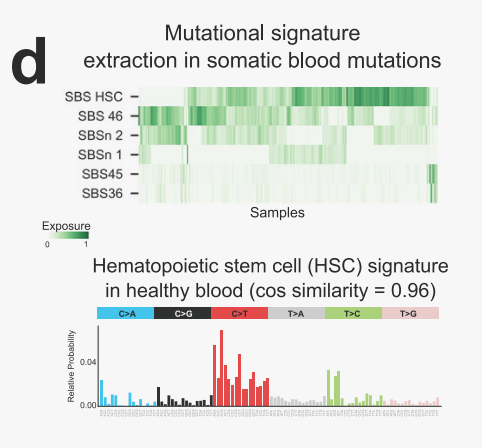

# Discovering the drivers of clonal hematopoiesis

这张图（**Figure 1d**）展示了在**血液体细胞突变**中提取的**突变特征（Mutational Signature）**，以及这些特征在**健康血液造血干细胞（HSC）**中的表现和相似性分析。  

---

### **图的上半部分：突变特征提取（Mutational Signature Extraction）**  
1. **图像描述：**  
   - 热图，横轴为**样本（Samples）**，纵轴为**突变特征（Signatures）**。  
   - **颜色深浅（Exposure 0-1）：** 代表特征在样本中的**暴露强度（Exposure Strength）**，颜色越深，暴露越强。  
   
2. **标注解释：**  
   - **SBS HSC、SBS 46、SBS 2、SBS 1、SBS 45、SBS 36：**  
     - **SBS（Single Base Substitution）**：表示单碱基替换特征。  
     - 这些特征代表在不同样本中识别出的突变模式。  
   - **SBS HSC 特征：**  
     - 这是在**造血干细胞（HSC）**中识别的特定突变特征。  
     - **颜色较深**，表明在多个样本中都能明显检测到这种特征。  
   
3. **含义解读：**  
   - 通过对**血液样本中的体细胞突变**进行特征提取，发现了**6种不同的突变特征（包括 HSC 特征）**。  
   - **HSC 突变特征**在多个样本中都有显著暴露，说明这些突变可能是**HSC 自然分裂过程中的背景突变**，而非疾病特异性突变。  

---

### **图的下半部分：HSC 簇特征（Hematopoietic Stem Cell Signature）**  
1. **图像描述：**  
   - 条形图，显示**HSC 突变特征的三核苷酸分布**。  
   - **横轴：** 突变类型（如 **C>A, C>G, C>T, T>A, T>C, T>G**），按照**突变上下文**分组（如 **ACA, ACG, ACT** 等）。  
   - **纵轴：** **相对概率（Relative Probability）**，即特定三核苷酸变异的频率。  
   - **颜色区分：** 不同类型的碱基替换使用不同颜色标记。  

2. **标注解释：**  
   - **Cosine Similarity = 0.96：**  
     - 将提取的**突变特征**与已知的**健康造血干细胞突变特征**进行比较，得到**余弦相似度为 0.96**。  
     - **高相似性（接近 1）：** 说明**突变特征几乎一致**，表明这些突变确实可能是**HSC 自发突变**，而非后天疾病相关突变。  
   
3. **含义解读：**  
   - 这些突变特征在**健康个体的 HSC 中**同样存在，说明在分析**疾病样本**时，必须区分哪些突变是**自然背景突变**，哪些是**疾病特异性突变**。  
   - **三核苷酸上下文分析**显示，这种背景突变特征在健康人群中**普遍存在**，与疾病发展无直接关联。  

---

### **综合解释：**  
- 研究者通过**突变特征提取**，在血液样本中识别出多种**突变特征（SBS HSC 等）**，并发现其中一种特征（SBS HSC）与**健康 HSC 突变特征**具有高度相似性（余弦相似度 0.96）。  
- 这说明许多在血液样本中发现的突变可能不是**疾病特异性突变**，而是**造血干细胞自然分裂过程中**形成的**背景突变**。  
- **研究意义：**  
  - 识别这些背景突变特征有助于**去噪**，即区分**自然突变**和**疾病驱动突变**，从而更精准地分析**肿瘤或血液病的突变特征**。

### **1. HSC 的突变特征（Hematopoietic Stem Cell Mutational Signature）**  

**HSC 突变特征**是指在**造血干细胞（Hematopoietic Stem Cells, HSCs）**中**自然累积的基因突变模式**，这些突变特征反映了**HSC 分裂和自我更新**过程中，DNA 复制错误或自然衰老积累的**突变偏好**。  

#### **为什么会有 HSC 特征？**  
- **造血干细胞**是长期存在于骨髓中的干细胞，负责生成血液中的各种细胞类型（如红细胞、白细胞、血小板）。  
- 在一生中，HSC 需要进行**大量的自我更新和增殖**，每次**DNA 复制**都可能引入少量**自发突变**。  
- 随着**年龄增长**或**细胞分裂次数增多**，这些**突变特征**逐渐累积，并且具有**特定的三核苷酸分布特征**（如 **C>T 或 T>A**）。  

#### **HSC 突变特征的特点：**  
- **三核苷酸突变模式（Tri-nucleotide Context）：**  
  - 突变特征不仅仅是碱基替换（如 C>T），还涉及**上下游核苷酸的上下文组合**（如 **ACA -> ATA**）。  
- **自然累积而非疾病驱动：**  
  - HSC 突变特征更多是由于**自然老化或细胞分裂错误**，而非特定**致癌突变**。  
- **突变特征相对稳定：**  
  - 由于 HSC 的长期存在，这些突变特征在**健康个体中相对一致**。  
- **常见突变类型：**  
  - 例如，**C>T 突变**往往是**HSC 突变特征**中的常见形式，这在**老年人和 CHIP（体细胞克隆增生）**中尤为显著。  

---

### **2. 余弦相似度（Cosine Similarity）**  

**余弦相似度**是用于衡量**两个向量之间相似性**的指标，取值范围为 **[-1, 1]**。  
- **值为 1**：表示两个向量**完全相同**  
- **值为 0**：表示两个向量**完全不相关**  
- **值为 -1**：表示两个向量**完全相反**  

#### **数学定义：**  
给定两个向量 **A** 和 **B**，余弦相似度定义为：  

\[
\text{cosine similarity} = \frac{A \cdot B}{\|A\| \|B\|} = \frac{\sum (A_i \times B_i)}{\sqrt{\sum A_i^2} \times \sqrt{\sum B_i^2}}
\]  

#### **解释：**  
- **A · B**：表示**向量点积**  
- **||A||** 和 **||B||**：表示**向量模长**  
- 计算的是**两个向量之间的夹角余弦值**，**角度越小，相似度越高**。  

---

### **3. HSC 突变特征和余弦相似度的结合应用**  

在图中，研究者提取了一种**突变特征（SBS HSC）**，并将其与**已知 HSC 的自然突变特征**进行比较：  
- **余弦相似度 = 0.96**：  
  - 表示**两个特征几乎一致**，说明这些在肿瘤样本中观察到的突变特征，其实与**健康 HSC 的自然突变特征高度相似**。  
- **结论：**  
  - 这种高相似性表明，很多检测到的**体细胞突变**并非疾病特异性突变，而是由于**HSC 自然分裂引起的背景突变**。  
  - 因此，在分析肿瘤样本时，应该**剔除这些背景突变**，以免误将自然突变视为疾病驱动突变。  

---

### **总结：**  
1. **HSC 突变特征**代表造血干细胞在分裂过程中**自然累积的突变特征**。  
2. **余弦相似度**用于衡量提取突变特征与已知 HSC 自然突变特征之间的**相似性**。  
3. **相似度为 0.96** 表示这些突变特征大概率是**HSC 自然突变**，而非疾病特异性突变。  
4. **去噪分析：** 在肿瘤突变特征分析中，去除这些**HSC 背景突变**可以更准确地识别**疾病驱动突变**。

### **HSC Signature（造血干细胞突变特征）的构建方法**  

这段文字描述了如何从**健康供体血液样本**中提取和计算**造血干细胞突变特征（HSC Signature）**。  

---

#### **1. 数据来源：**  
- **样本：**  
  - **23个健康供体血液样本**，供体年龄不同，确保数据的代表性和全面性。  
- **变异类型：**  
  - **全基因组体细胞变异（Whole-Genome Somatic Variants）**  
- **数据获取：**  
  - 来自**Osorio et al.** 的研究，研究者通过申请获得。  

---

#### **2. HSC 突变特征计算步骤：**  

##### **步骤一：突变特征提取（Mutational Signature Extraction）**  
- **方法：**  
  - 使用**非负矩阵分解（NMF, Non-negative Matrix Factorization）**提取突变特征。  
  - 工具：**SigProfilerJulia**（改进自 Alexandrov 等人的算法）  
  - **输入数据：**  
    - **体细胞突变谱**（mosaic set），包含大量突变的样本（**仅包含突变数 > 100 的样本**）。  
  - **输出数据：**  
    - **突变特征矩阵：** 行表示突变特征（SBS），列表示样本，每个元素是某特征在样本中的**暴露量**。  

##### **步骤二：与COSMIC特征对比**  
- **特征对比：**  
  - 提取的特征与**COSMIC V3（PCAWG）** 突变特征进行对比。  
  - **相似性衡量：** 使用**余弦相似度（Cosine Similarity）**来判断新提取特征和已知特征的相似性。  
- **排除低突变样本：**  
  - **原发性肿瘤样本**（外显子组测序）突变数过少，未提取特征。  

##### **步骤三：HSC 特征计算（基于健康供体样本）**  
- **统计突变分布：**  
  - 将每个健康供体血液样本中的**突变**按照**96个三核苷酸突变上下文**进行分类（如 **ACA>CGA**）。  
- **特征归一化：**  
  - 计算**每个三核苷酸上下文的平均突变数**：  
    \[
    \text{Average\_Mutations} = \frac{\text{每种突变在23个样本中的突变数总和}}{23}
    \]  
  - **相对突变概率计算：**  
    \[
    \text{Relative Probability} = \frac{\text{每种突变的平均数}}{\text{所有突变总数}}
    \]  
  - **归一化：** 确保所有上下文加和为**1**。  

---

#### **3. HSC Signature 公式化：**  
假设：  
- **\( M_{ij} \)** 表示第**i**个样本中第**j**个三核苷酸上下文的突变数。  
- **\( n \)** 为样本数量（23个）。  
- **\( T_i \)** 为第**i**个样本的**总突变数**。  
- **\( P_j \)** 表示**第j种三核苷酸突变上下文的相对概率**。  

\[
P_j = \frac{\frac{1}{n} \sum_{i=1}^{n} M_{ij}}{\frac{1}{n} \sum_{i=1}^{n} T_i}
\]  

- **解释：**  
  - 分子：23个健康供体中**每种三核苷酸突变的平均数**。  
  - 分母：**所有突变总数的平均值**，用于归一化。  
  - **得到的Pj值**：代表**每种三核苷酸上下文突变在HSC中的相对贡献**。  

---

### **4. HSC Signature 的意义：**  
- **背景突变特征：**  
  - 由于 HSC 长期自我更新和分裂，DNA 复制错误或衰老引起的**自然突变**不断累积，形成稳定的**三核苷酸突变特征**。  
- **疾病背景校正：**  
  - 在分析**肿瘤样本突变特征**时，HSC signature 可以作为**背景校正**，区分哪些是**疾病驱动突变**，哪些是**正常突变噪声**。  
- **高余弦相似度（0.96）：**  
  - 提示肿瘤样本中的一些突变特征可能是**HSC 自然突变**，而非肿瘤特异性突变。  

---

### **5. 总结：**  
**HSC Signature** 的计算步骤如下：  
1. 从健康供体样本中提取**突变特征**。  
2. 计算每个**三核苷酸上下文的平均突变数**。  
3. 归一化以得到**相对突变概率**。  
4. 在肿瘤样本分析中，与已知HSC signature进行**余弦相似性比较**，去除**背景突变**。  

这种方法可以有效剔除**非特异性突变噪声**，更准确地识别**疾病相关突变特征**。

### **原文翻译及解释：**  

#### **翻译：**  
首先，**CH突变**（即影响**CH驱动基因**的突变）出现的概率，以及因此导致**HSC克隆扩增**的概率，都会随着年龄的增长而增加。  

其次，在这个**HSC克隆起源细胞**中，**血液突变数量**（由于克隆扩增而被放大）也会随着年龄增长而增加，因为**血液突变**会在每次**HSC分裂**时以稳定速率累积。  

第三，**克隆扩增开始时间**与**样本获取时间**之间的时间间隔（通常随着供体年龄的增加而延长）越长，这些血液突变的**等位基因频率（VAF）**就越高，从而使这些突变更容易**超出批量测序的检测下限**。  

---

### **解释：**  

#### **1. CH突变及HSC克隆扩增概率随年龄增加**  
- **CH突变（Clonal Hematopoiesis Mutation）：**  
  - 指在**造血干细胞（HSC）**中发生的**体细胞突变**，这些突变通常发生在**驱动基因**上（如 **DNMT3A**、**TET2**）。  
- **年龄效应：**  
  - 随着年龄的增长，HSC 经过**更多次分裂**，累积**突变概率增加**。  
  - 因此，**CH突变的出现概率**随着年龄增加而升高。  
- **克隆扩增：**  
  - 当**HSC中积累足够多的突变**，特别是**驱动突变**时，突变细胞可能**克隆扩增**，即快速分裂形成**具有相同突变的克隆群体**。  

---

#### **2. HSC克隆起源细胞中的突变累积**  
- **克隆起源细胞（Clone Founder）：**  
  - 指最早发生突变并最终导致克隆扩增的**初始HSC细胞**。  
- **突变累积规律：**  
  - HSC 细胞在**每次分裂**时，都会**稳定积累突变**。  
  - 因此，**年龄越大**，HSC 中自然累积的突变就越多。  
- **克隆扩增的放大效应：**  
  - 起源于同一个突变细胞的克隆细胞在扩增过程中，**突变数量随着克隆规模扩大而被放大**。  
  - 所以，**年长个体中的CH突变克隆**，其**突变数量明显更多**。  

---

#### **3. 克隆扩增持续时间与VAF**  
- **VAF（Variant Allele Frequency）：**  
  - 突变**等位基因频率**，表示突变等位基因在总体基因中的**占比**。  
  - **计算公式：**  
    \[
    \text{VAF} = \frac{\text{突变等位基因数}}{\text{所有等位基因数}}
    \]  
- **年龄对VAF的影响：**  
  - HSC克隆扩增是一个**逐渐累积**的过程，起始较慢，后期加速。  
  - **扩增时间越长（通常伴随年龄增加），VAF越高**。  
- **检测下限问题：**  
  - 在**早期阶段**，由于克隆规模小，**VAF很低**，难以通过**批量测序**检测到。  
  - **年龄增加**使克隆扩增持续时间更长，**突变等位基因频率升高**，更容易被检测到。  

---

### **总结：**  
这段话强调了**CH突变及HSC克隆扩增**随着**年龄增长**而增加的趋势，指出三个关键点：  
1. **CH突变概率与克隆扩增概率**随年龄增长而增加。  
2. **HSC克隆起源细胞的突变数量**随着**HSC分裂次数**和**年龄**的增加而增加。  
3. **克隆扩增时间**越长，突变**等位基因频率（VAF）**越高，使突变更容易**被批量测序检测到**。  

这些现象表明，**年长个体**由于**HSC分裂次数多、克隆扩增时间长**，往往**更容易检测到CH突变**，这也是在**老年群体中CHIP（体细胞克隆增生）更常见**的原因。
